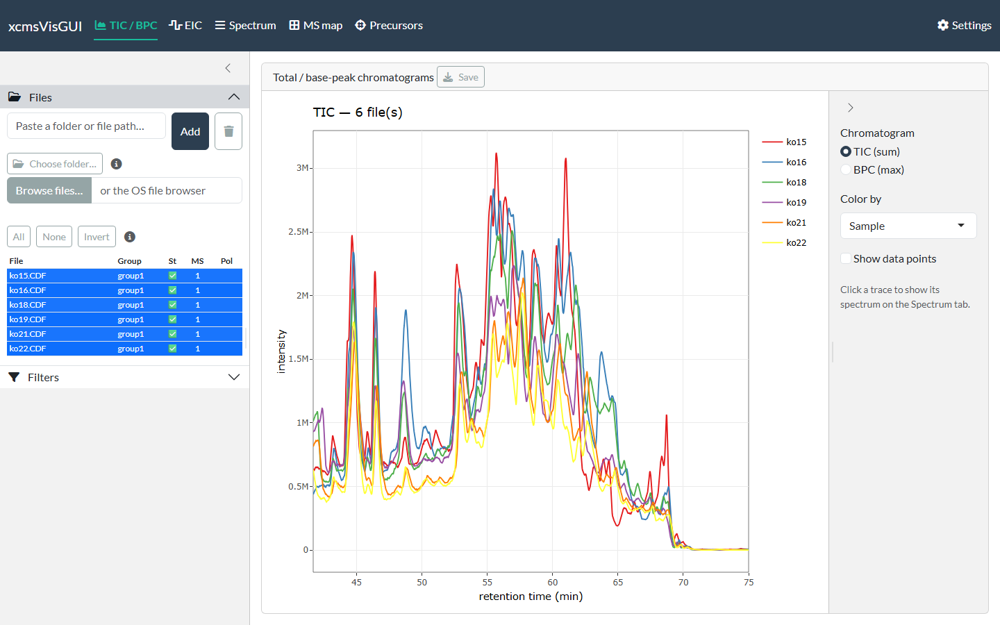

# TIC / BPC

The first tab overlays the **total-ion** (sum) or **base-peak** (max)
chromatogram of every included file. It renders as soon as one file is
included, and re-extracts only when the included file set or the global
filters change.

The TIC overlay across included files

## Controls

- **TIC (sum) / BPC (max)** — total-ion vs. base-peak chromatogram.
- **Color by** — *Sample* (one colour per file) or *Sample group* (the
  Group column in the file list). Colours are ColorBrewer qualitative.
- **Show data points** — overlay the individual scan points on the
  lines.

Retention time uses the display unit set in
[Settings](https://stanstrup.github.io/xcmsVisGUI/articles/getting_started.html#settings),
and the MS level / intensity / spectrum-ID filters from the **Filters**
panel apply here too.

## Moving between tabs

**Click any trace** to send that file and retention time to the
**Spectrum** tab; switch to the
[Spectrum](https://stanstrup.github.io/xcmsVisGUI/articles/spectrum.md)
tab to view the scan at that point. This is the quickest way to inspect
“what is under this peak?” — find a feature on the TIC, click it, and
read its mass spectrum.

## Export

**Save** writes a static png/svg/pdf (or the raw ggplot `.rds`) using
the
[Settings](https://stanstrup.github.io/xcmsVisGUI/articles/getting_started.html#settings)
export defaults.
