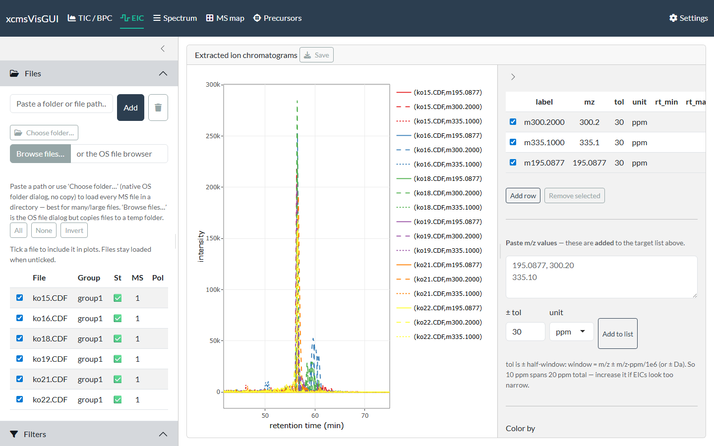

```{r, include = FALSE}
knitr::opts_chunk$set(echo = FALSE, eval = FALSE)
```

The EIC tab extracts one or more *m/z* windows across the included files and
overlays the traces. A target table in the sidebar drives the extraction.

{width=100%}

## Building the target list

There are three ways to add targets — they all append to the same table:

- **Click peaks in the Spectrum tab.** Clicking a peak on the
  [Spectrum](spectrum.html) view adds its *m/z* to this list (its default click
  action). This is the usual workflow: open a spectrum, click the ions you care
  about, then come here to see their chromatograms.
- **Paste m/z values.** Paste a comma/newline-separated list into the box and click
  **Add to list**; the tolerance/unit next to it seed the new rows.
- **Add a blank row** with **Add row** and type the *m/z* in.

Each row is editable: **label**, **m/z**, **tol**, **unit** (ppm or Da), and an
optional **rt window**. The tolerance is a ± half-window, so 10 ppm spans 20 ppm
total — widen it if traces look too narrow. Untick a row's checkbox to drop it from
the plot without deleting it; **Remove selected** deletes rows. The default
tolerance/unit for new targets come from [Settings](getting_started.html#settings).

## Display

- **Color by** — *File*, *Target*, or *Sample group*. When not colouring by target,
  multiple targets are distinguished by line type.
- **Show data points** — overlay scan points.
- **Facet by file** — one panel per file instead of a single overlay.

The global **Filters** (MS level, intensity, …) apply to the extraction.

## Moving between tabs

**Click any EIC trace** to send that file and retention time to the
[Spectrum](spectrum.html) tab, then switch to it to read the spectrum at that point
— handy for confirming a co-eluting ion or checking peak purity.

## Export

**Save** writes a static png/svg/pdf (or the raw ggplot `.rds`).
