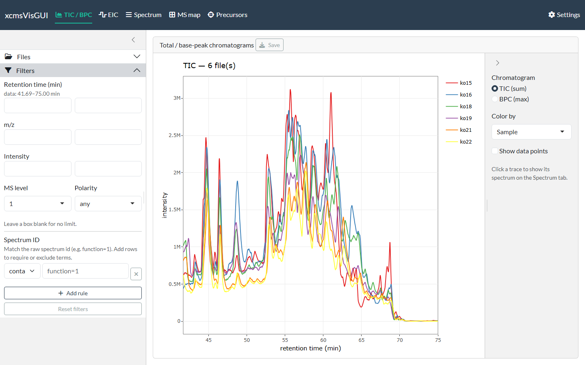
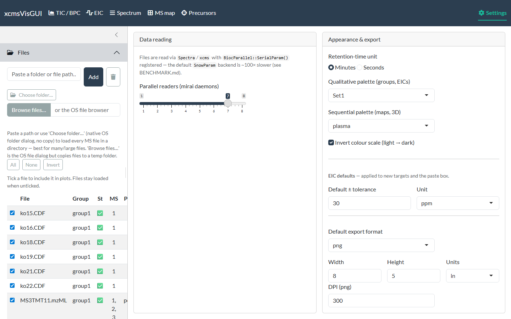

```{r, include = FALSE}
knitr::opts_chunk$set(echo = FALSE, eval = FALSE)
```

xcmsVisGUI is a local Shiny desktop app for exploring **raw** LC-MS data
interactively — TIC/BPC, extracted-ion chromatograms, spectra (with adduct /
isotope / fragment annotation), 2D/3D maps and DDA precursors. Scope is **raw
visualisation only**: no peak picking, grouping or alignment.

This page covers the cross-cutting basics — launching, loading files, filtering,
settings and export. Each plot view then has its own guide:

- [TIC / BPC](tic_bpc.html) — total- and base-peak chromatograms
- [EIC](eic.html) — extracted-ion chromatograms
- [Spectrum](spectrum.html) — single spectra, the scan-list browser, and annotation
- [MS map](ms_map.html) — 2D and 3D *m/z* × time maps
- [Precursors](precursors.html) — DDA precursor-ion map

The screenshots come from example LC-MS runs — a positive-mode QTOF urine series
and the `faahKO` / `msdata` demo datasets that ship with Bioconductor.

## Launch

Install it first (see the [README](https://github.com/stanstrup/xcmsVisGUI#install)),
then the app is the exported function `run_app()`:

```{r, eval = FALSE, echo = TRUE}
# installed:
xcmsVisGUI::run_app()

# or from a clone (no install needed):
# Rscript run.R
```

A browser tab opens with five plot views across the top (**TIC/BPC**, **EIC**,
**Spectrum**, **MS map**, **Precursors**), a **Settings** page, and a left sidebar
with **Files** and **Filters**. The sidebar and filters apply to every view.

## 1. Load files

Open the **Files** panel and add data three ways — all keep multi-GB files in
place (no copy) except the OS file browser:

* **Paste a folder or file path** and click **Add** — loads every MS file in a
  folder (`.mzML` / `.mzXML` / `.CDF`), or a single file if you paste a file path.
* **Choose folder…** — native OS folder dialog (Windows), no copy.
* **Browse files…** — the OS file dialog; note it *copies* the chosen files to a
  temp folder.

Files are read asynchronously (a status badge flips from ⏳ to ✅), so the UI stays
responsive even with many files. **Click a file's row to include it** in the plots
(the row highlights); click it again to exclude. Files stay loaded either way, so
toggling is cheap. **All / None / Invert** select in bulk, and double-clicking the
**Group** cell renames that file's sample group (used for colouring and faceting).
As soon as one file is included, the TIC renders:

{width=100%}

## 2. Filter (optional)

The **Filters** panel applies globally to every view. Leave a box blank for no
limit; retention-time boxes use the display unit (set in Settings) and the data
range is shown as a hint.

{width=100%}

You can constrain retention time, *m/z*, intensity, MS level and polarity. The
**Spectrum ID** section matches against the raw spectrum id (e.g. the Waters
`function=1 process=0 scan=…`): add one or more rules with **Add rule**, each set to
**contains** (the id must include the term) or **exclude** (it must not). Multiple
`contains` rules are ANDed, so you can keep e.g. `function=1` while excluding
`function=2`. Matching is a literal substring (so `scan=1` also matches `scan=10`,
`scan=199`, …). **Reset filters** clears everything. If a filter combination matches
no spectra, the plots show "No spectra match the current filters." rather than an
error.

## Moving between tabs

The views are linked through clicks, so you rarely retype a number:

- **Click a chromatogram trace** (TIC/BPC or EIC), **a map pixel** (MS map) or **a
  precursor** (Precursors) and the **Spectrum** tab is loaded with that file and
  retention time — switch to the Spectrum tab to view it.
- **Click a peak in a spectrum** to add its *m/z* to the **EIC** target list (the
  default), then open the EIC tab to extract it across files.

Each view's guide spells out its own click actions.

## Settings

Settings persist across restarts (stored in your per-user config directory):

* **Retention-time unit** — minutes or seconds (applied everywhere; data is always
  handled in seconds internally).
* **Palettes** — ColorBrewer qualitative (traces/groups) and viridis/sequential
  (maps); the scale can be inverted.
* **EIC defaults** — default tolerance value and unit for new targets.
* **Parallel readers** — the mirai daemon-pool size for async file reading.
* **Export defaults** — format (png/svg/pdf), size, units, DPI.

{width=100%}

## Export

Every plot has a **Save** button that exports a crisp static image (png/svg/pdf via
`ggsave`) from the underlying ggplot — independent of the on-screen plotly — using
the size/format defaults from Settings. You can also save the raw ggplot object
(`.rds`) to tweak later in R.
