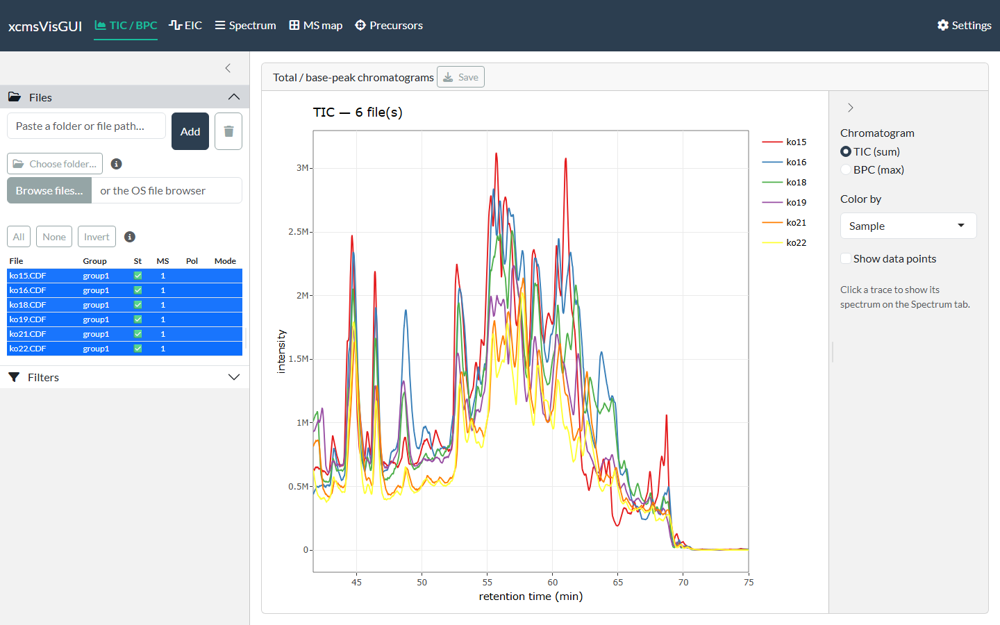
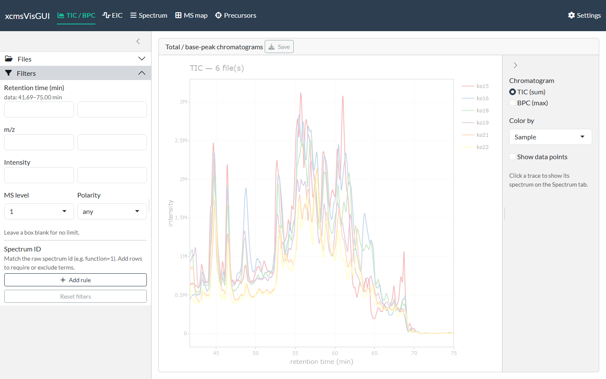
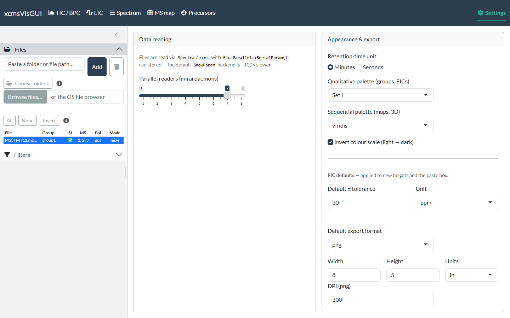

```{r, include = FALSE}
knitr::opts_chunk$set(echo = FALSE, eval = FALSE)
```

xcmsVisGUI is a local Shiny desktop app for exploring **raw** LC-MS data
interactively — TIC/BPC, extracted-ion chromatograms, spectra (with adduct /
isotope / fragment annotation, including formula-based fine isotope patterns),
2D/3D maps and DDA precursors. It centroids profile scans on the fly for display,
but its scope is still **raw visualisation**: there is no cross-sample peak
picking, feature grouping or retention-time alignment.

This page covers the cross-cutting basics — launching, loading files, filtering,
settings and export. Each plot view then has its own guide:

- [TIC / BPC](tic_bpc.html) — total- and base-peak chromatograms
- [EIC](eic.html) — extracted-ion chromatograms
- [Spectrum](spectrum.html) — single spectra, the scan-list browser, and annotation
- [MS map](ms_map.html) — 2D and 3D *m/z* × time maps
- [Precursors](precursors.html) — DDA precursor-ion map

The screenshots come from example LC-MS runs — a positive-mode QTOF urine series
and the `faahKO` / `msdata` demo datasets that ship with Bioconductor.

## Launch

Install it first (see the [README](https://github.com/stanstrup/xcmsVisGUI#install)),
then the app is the exported function `run_app()`:

```{r, eval = FALSE, echo = TRUE}
# installed:
xcmsVisGUI::run_app()

# or from a clone (no install needed):
# Rscript run.R
```

A browser tab opens with five plot views across the top (**TIC/BPC**, **EIC**,
**Spectrum**, **MS map**, **Precursors**), a **Settings** page, and a left sidebar
with **Files** and **Filters**. The sidebar and filters apply to every view.

## 1. Load files

Open the **Files** panel and add data three ways — all keep multi-GB files in
place (no copy) except the OS file browser:

* **Paste a folder or file path** and click **Add** — loads every MS file in a
  folder (`.mzML` / `.mzXML` / `.CDF`), or a single file if you paste a file path.
* **Choose folder…** — native OS folder dialog (Windows), no copy.
* **Browse files…** — the OS file dialog; note it *copies* the chosen files to a
  temp folder.

Files are read asynchronously (a status badge flips from ⏳ to ✅), so the UI stays
responsive even with many files. **Click a file's row to include it** in the plots
(the row highlights); click it again to exclude. Files stay loaded either way, so
toggling is cheap. **All / None / Invert** select in bulk, and double-clicking the
**Group** cell renames that file's sample group (used for colouring and faceting).
Two files that share a name but come from different folders are both kept, and are
distinguished in the plots by their parent folder (e.g. `sample (plate1)`). As soon
as one file is included, the TIC renders:

{width=100%}

## 2. Filter (optional)

The **Filters** panel applies globally to every view. Leave a box blank for no
limit; retention-time boxes use the display unit (set in Settings) and the data
range is shown as a hint.

{width=100%}

You can constrain retention time, *m/z*, intensity, MS level and polarity. The
**Spectrum ID** section matches against the raw spectrum id (e.g. the Waters
`function=1 process=0 scan=…`): add one or more rules with **Add rule**, each set to
**contains** (the id must include the term) or **exclude** (it must not). Multiple
`contains` rules are ANDed, so you can keep e.g. `function=1` while excluding
`function=2`. Matching is a literal substring (so `scan=1` also matches `scan=10`,
`scan=199`, …). **Reset filters** clears everything. If a filter combination matches
no spectra, the plots show "No spectra match the current filters." rather than an
error.

### Profile-mode data

Raw files come in two flavours: **centroided** (one point per detected ion) and
**profile** (every detector sample, so a single peak is tens of points). The app
reads which one you have from the file itself and shows it in the **Mode** column
of the file list — `prof`, `cent`, or `mix` for a file that is profile at one MS
level and centroided at another (a very common Thermo DDA setup: profile MS1,
centroided MS2).

Left as-is, profile data is awkward to work with: one Orbitrap MS1 scan can be
~17 000 points, and a whole file ~29 million. Peak-picking (centroiding) reduces
each profile scan to its peaks. Because it is *data processing*, not a filter, the
control lives in the right-hand panel of the two views that draw peaks — the
**Spectrum** and **MS map** tabs — under **Peak picking**, not in the Filters
panel. Each view has its own setting, with a sensible default:

- The **Spectrum** view defaults to **Raw**: you opened it to look at the data, and
  one scan is cheap. Raw profile is drawn as a continuous **line** (what it actually
  is, not sticks) and the title is marked *profile*. A click returns exactly the
  *m/z* you clicked (the nearest raw sample); to click the true peak centroid,
  switch to **Centroid profile scans** — a conventional stick spectrum — or turn on
  **Raw + centroids overlay** and click the centroid.
- The **MS map** defaults to **Centroid profile scans**. It has to: mapping every
  raw sample is tens of millions of points per file. Only the levels that really are
  profile get picked, so a mixed file keeps its centroided MS2 spectra untouched.
  (Its setting takes effect on the next **Plot**.)

**Force centroid (all scans)** peak-picks every level, even ones the file flags as
already centroided. The Spectrum tab also offers **Raw + centroids overlay**, which
draws the raw profile line *and* the picked centroids (sticks) on top, so you can
see exactly what peak picking keeps.

When picking is on, three settings appear:

- **S/N** — signal-to-noise floor; raise it to drop noise peaks (0 keeps every
  local maximum).
- **Half-window** — how many points on each side a peak must top to count as a
  local maximum; larger merges closely-spaced peaks.
- **m/z accuracy: average ±N points** — replaces each centroid's apex *m/z* with the
  intensity-weighted mean of its ± N neighbouring raw samples (0 = keep the apex).
  A small value (2–3) gives sub-sample mass accuracy on profile data.

Chromatograms (TIC / BPC / EIC) are never centroided, whatever this is set to:
they sum or max intensities across an *m/z* window, which is correct on profile
samples and reproduces the TIC the instrument recorded.

## Moving between tabs

The views are linked through clicks, so you rarely retype a number:

- **Click a chromatogram trace** (TIC/BPC or EIC), **a map pixel** (MS map) or **a
  precursor** (Precursors) and the **Spectrum** tab is loaded with that file and
  retention time — switch to the Spectrum tab to view it.
- **Click a peak in a spectrum** to add its *m/z* to the **EIC** target list (the
  default), then open the EIC tab to extract it across files.

Each view's guide spells out its own click actions.

## Settings

Settings persist across restarts (stored in your per-user config directory):

* **Retention-time unit** — minutes or seconds (applied everywhere; data is always
  handled in seconds internally).
* **Palettes** — ColorBrewer qualitative (traces/groups) and viridis/sequential
  (maps); the scale can be inverted.
* **EIC defaults** — default tolerance value and unit for new targets.
* **Parallel readers** — the mirai daemon-pool size for async file reading.
* **Export defaults** — format (png/svg/pdf), size, units, DPI.

{width=100%}

## Export

Every plot has a **Save** button that exports a crisp static image (png/svg/pdf via
`ggsave`) from the underlying ggplot — independent of the on-screen plotly — using
the size/format defaults from Settings. You can also save the raw ggplot object
(`.rds`) to tweak later in R.
