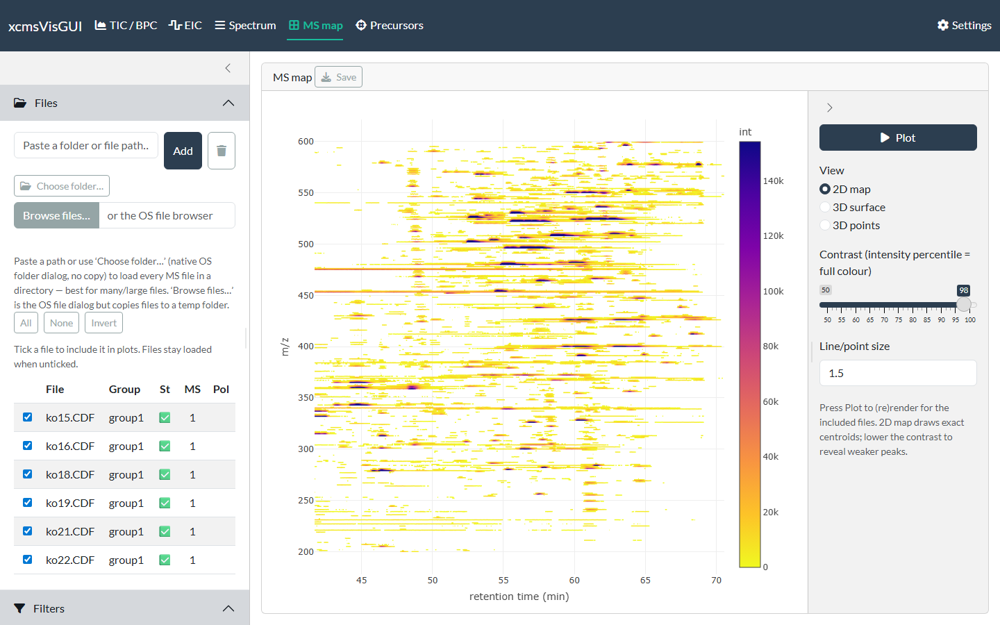
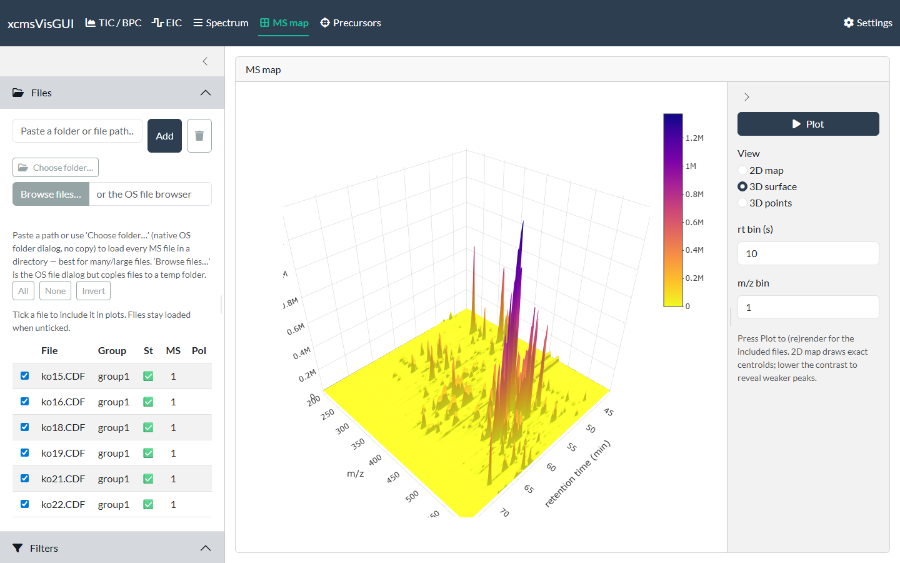

```{r, include = FALSE}
knitr::opts_chunk$set(echo = FALSE, eval = FALSE)
```

The MS map plots a 2-D *m/z* × retention-time view of the included files. It draws
**exact centroids** (no binning) with an mzMine-style **contrast** control — lower
the contrast to reveal weaker peaks.

This view is **gated**: press **Plot** to render, so it never auto-extracts every
file as you change unrelated settings.

{width=100%}

## 3D views

Switch the view to **3D surface** or **3D points** for a binned surface / scatter
you can rotate. The bin sizes (and, for points, an intensity cutoff) are set in the
sidebar.

{width=100%}

## Moving between tabs

**Click a pixel** on the 2-D map to send that retention time to the
[Spectrum](spectrum.html) tab (for the first included file); switch to the Spectrum
tab to read the full scan there. It's a fast way to go from "there's a spot here" to
the actual mass spectrum.

## Export

**Save** writes a static image of the 2-D map.
