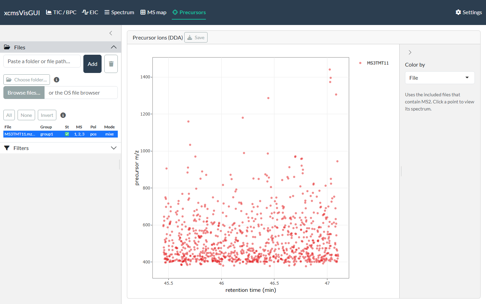

```{r, include = FALSE}
knitr::opts_chunk$set(echo = FALSE, eval = FALSE)
```

For **data-dependent acquisition (DDA)**, the Precursors tab maps each fragmented
precursor ion as a point at its retention time × precursor *m/z*, across the
included MS2 files. It is the quickest way to see *what* was selected for
fragmentation and *when*.

{width=100%}

- **Color by** — *File*, *Sample group*, or none.
- Only files that contain MS2 spectra contribute; if none do, the view says so.

## Filters

The global **Filters** apply here too, read as filters on the *precursors*:

- **Retention time**, **polarity** and **spectrum id** rules select which MS2
  scans are shown, as everywhere else.
- **m/z** and **intensity** act on the precursor *m/z* (the y axis) and the
  precursor intensity. A precursor whose intensity the file does not report is
  kept.
- The **MS level** filter is ignored unless it names an MSn level (2, 3, ...):
  the default MS1 setting would otherwise leave the map empty.

## Moving between tabs

**Click a precursor point** to send its file, retention time and precursor *m/z* to
the [Spectrum](spectrum.html) tab; switch there to view the corresponding MS2
spectrum — and from that spectrum you can click fragment peaks straight into the
[EIC](eic.html) list.

## Export

**Save** writes a static image of the precursor map.
