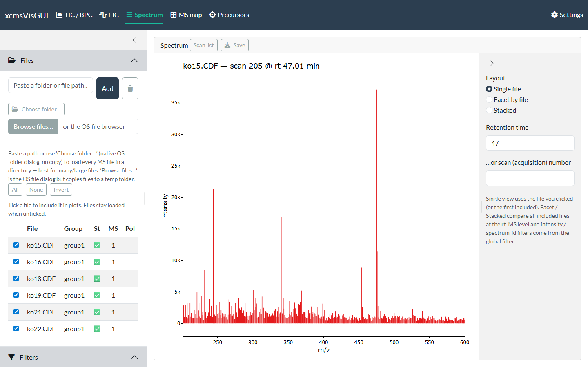
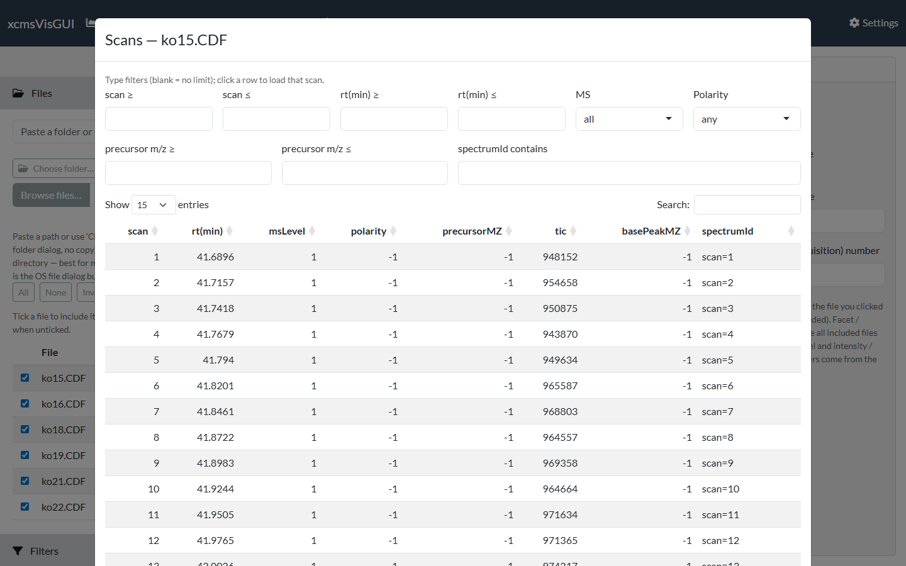
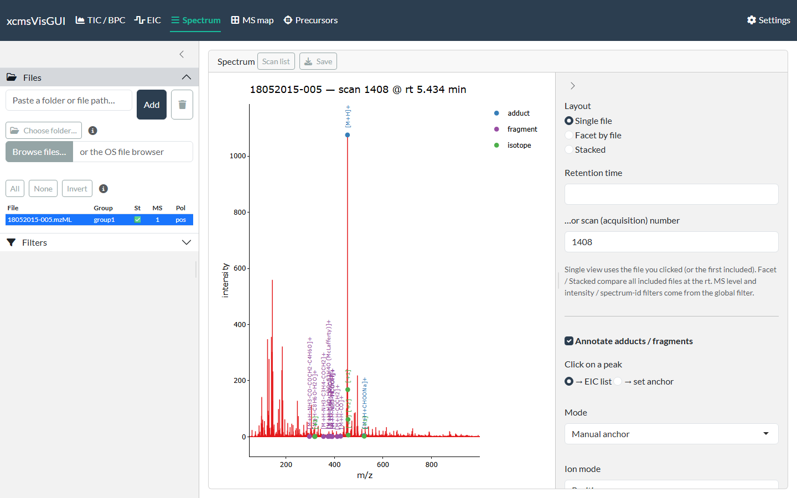

```{r, include = FALSE}
knitr::opts_chunk$set(echo = FALSE, eval = FALSE)
```

The Spectrum tab shows the mass spectrum at a chosen retention time or scan, with
optional adduct / isotope / fragment annotation.

{width=100%}

## Choosing the spectrum

- **Arrive by clicking.** Clicking a trace on the [TIC/BPC](tic_bpc.html) or
  [EIC](eic.html) view, a pixel on the [MS map](ms_map.html), or a point on the
  [Precursors](precursors.html) view fills in the file and retention time here — so
  you usually reach this tab by clicking, not typing.
- **Type a retention time**, or an **acquisition scan number** (single-file view).
- **Layout** — **Single file** shows the file you clicked (or the first included);
  **Facet** / **Stacked** compare all included files at the same retention time.

The MS level / intensity / spectrum-ID **Filters** apply to which spectrum is shown.

## From spectrum to EIC

**Click a peak** to add its *m/z* to the [EIC](eic.html) target list (the default
click action). Click the ions you want, then open the EIC tab to extract their
chromatograms across files. (When annotation is on you can switch the click action
to *set anchor* instead — see below.)

## Scan list

The **Scan list** button opens a searchable table of every scan's metadata (rt, MS
level, polarity, precursor *m/z*, TIC, base peak, spectrum ID). Type in the filter
boxes to narrow it, and **click a row** to load that scan into the view.

{width=100%}

## Annotating adducts, isotopes & fragments

Tick **Annotate adducts / fragments** (single-file view) to overlay adduct,
isotope and in-source-fragment labels on the spectrum. The adduct/fragment
dictionary comes from the [commonMZ](https://github.com/stanstrup/commonMZ)
package; the ion mode defaults to the file's polarity.

{width=100%}

There are three modes:

- **Manual anchor** — pick the peak you believe is a known ion (default `[M+H]+` /
  `[M-H]-`, selectable). Switch *Click on a peak* to **→ set anchor** and click the
  peak, or type its *m/z*. The neutral mass is derived from it and every adduct and
  in-source fragment (from [commonMZ](https://github.com/stanstrup/commonMZ); the
  `[M+H-H2O]+` water-loss ladder, etc. — toggle with **In-source fragments**) is
  projected; matched peaks are labelled, and their isotopes (up to **Max isotope
  M+n**) are detected and labelled `[+1]`, `[+2]`, … An isotope peak is never also
  labelled an adduct/fragment. This is the most reliable mode — *you* decide the
  molecular ion, avoiding false hits on noisy raw data.
- **Auto-suggest (findMAIN)** — uses
  [InterpretMSSpectrum](https://cran.r-project.org/package=InterpretMSSpectrum)
  to rank candidate molecular-ion hypotheses (by explained intensity, mass error
  and isotope support). Hypotheses include the water-loss ion `[M+H-H2O]+`: if the
  base peak is itself a water loss, that is the right call and the neutral mass is
  derived from it (so `[M+H]+` is then annotated at base + 18). Press **Suggest
  molecular ion**; the top-scoring hypothesis is annotated immediately — click
  another row to switch. (Auto mode has no manual anchor box.)
- **Difference network** — annotates *pairs* of peaks whose *m/z* difference
  matches a known adduct/fragment, with no anchor needed (e.g. a ladder of water
  losses). Its match window is your instrument's mass accuracy at the two peaks,
  so set the tolerance to fit the instrument and raise the minimum intensity to
  drop noise pairs. Isotope-spaced differences are ignored.

The **± tol** is the adduct/fragment match window (ppm or Da); **Min intensity**
drops peaks below that fraction of the base peak before matching; **Max charge**
limits the charge states projected; **Annotate only top N peaks** keeps the N most
intense *annotated* peaks. **Isotope tol (mDa)** is a separate, usually wider
window for the isotope spacing (MS2 isotope centroids drift off the theoretical
spacing, and the error grows with each M+n step). **Isotopes decrease in
intensity** assumes a falling envelope (true for most biological samples) — with it
on, a heavier peak that is *more* intense is treated as a real loss (e.g. −H₂)
rather than an isotope. Labels are written vertically and multiple hits on one peak
are joined with "; ". **Show expected-but-absent** ghost ticks can be toggled.
Annotations are part of the plot, so they carry through to exports.

## Export

**Save** writes a static png/svg/pdf (or the raw ggplot `.rds`); annotations are
included.
