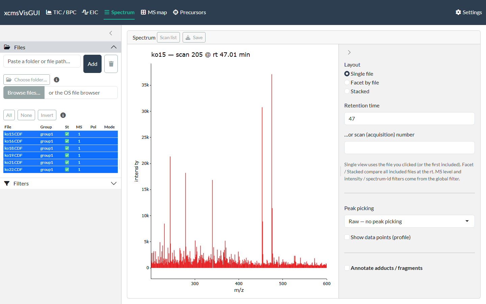
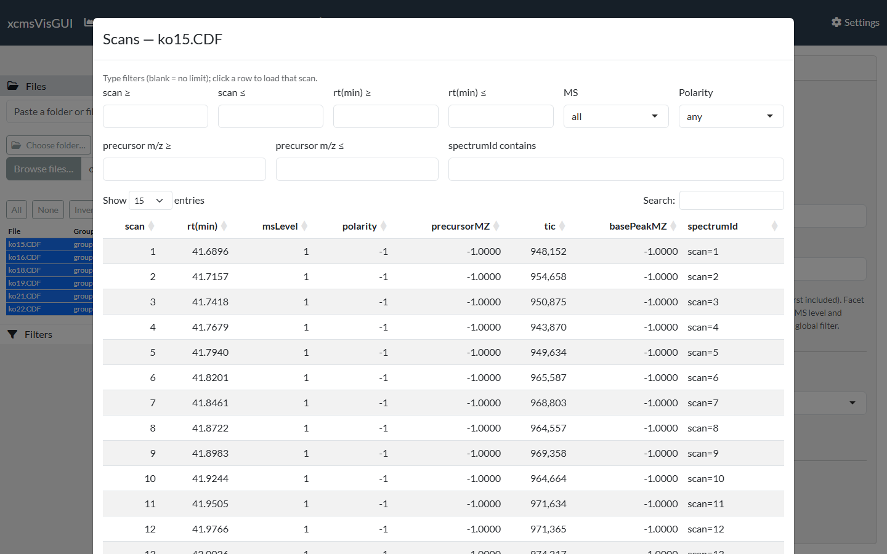
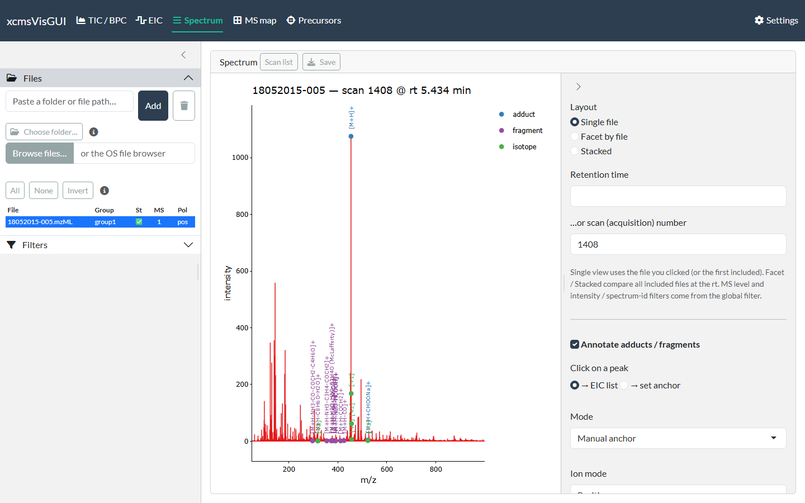

```{r, include = FALSE}
knitr::opts_chunk$set(echo = FALSE, eval = FALSE)
```

The Spectrum tab shows the mass spectrum at a chosen retention time or scan, with
optional adduct / isotope / fragment annotation.

{width=100%}

## Choosing the spectrum

- **Arrive by clicking.** Clicking a trace on the [TIC/BPC](tic_bpc.html) or
  [EIC](eic.html) view, a pixel on the [MS map](ms_map.html), or a point on the
  [Precursors](precursors.html) view fills in the file and retention time here — so
  you usually reach this tab by clicking, not typing.
- **Type a retention time**, or an **acquisition scan number** (single-file view).
- **Layout** — **Single file** shows the file you clicked (or the first included);
  **Facet** / **Stacked** compare all included files at the same retention time.

The MS level / intensity / spectrum-ID **Filters** apply to which spectrum is shown.

## Profile-mode files

If the file is profile-mode, this view shows the scan **raw** by default (the
**Peak picking** control in this tab's panel, default *Raw*). It is drawn as a
continuous **line** — which is what profile data actually is, rather than a stick
per detector sample — and the title is marked *profile*. A click returns exactly the
*m/z* you clicked (the nearest raw sample), which it sends to the EIC list or uses
as the annotation anchor. Set **Peak picking** to *Centroid profile scans* for a
conventional stick plot (the S/N, half-window and *m/z*-accuracy settings then
appear), or **Raw + centroids overlay** to draw the picked centroids on top of the
raw line — then a click can land on the true centroid. **Show data points** overlays
the individual detector samples. See
[Getting started](getting_started.html#profile-mode-data).

Annotation works whether you view the spectrum raw or centroided — see
*How annotation reduces the spectrum* below for exactly what it matches against.

## From spectrum to EIC

**Click a peak** to add its *m/z* to the [EIC](eic.html) target list (the default
click action). Click the ions you want, then open the EIC tab to extract their
chromatograms across files. (When annotation is on you can switch the click action
to *set anchor* instead — see below.)

## Scan list

The **Scan list** button opens a searchable table of every scan's metadata (rt, MS
level, polarity, precursor *m/z*, TIC, base peak, spectrum ID). Type in the filter
boxes to narrow it, and **click a row** to load that scan into the view.

{width=100%}

## Annotating adducts, isotopes & fragments

Tick **Annotate adducts / fragments** (single-file view) to overlay adduct,
isotope and in-source-fragment labels on the spectrum. The adduct/fragment
dictionary comes from the [commonMZ](https://github.com/stanstrup/commonMZ)
package; the ion mode defaults to the file's polarity.

{width=100%}

There are three modes:

- **Manual anchor** — pick the peak you believe is a known ion (default `[M+H]+` /
  `[M-H]-`, selectable). Switch *Click on a peak* to **→ set anchor** and click the
  peak, or type its *m/z*. The neutral mass is derived from it and every adduct and
  in-source fragment (from [commonMZ](https://github.com/stanstrup/commonMZ); the
  `[M+H-H2O]+` water-loss ladder, etc. — toggle with **In-source fragments**) is
  projected; matched peaks are labelled, and their isotopes (up to **Max isotope
  M+n**) are detected and labelled `[+1]`, `[+2]`, … An isotope peak is never also
  labelled an adduct/fragment. This is the most reliable mode — *you* decide the
  molecular ion, avoiding false hits on noisy raw data.
- **Auto-suggest (findMAIN)** — uses
  [InterpretMSSpectrum](https://cran.r-project.org/package=InterpretMSSpectrum)
  to rank candidate molecular-ion hypotheses (by explained intensity, mass error
  and isotope support). Hypotheses include the water-loss ion `[M+H-H2O]+`: if the
  base peak is itself a water loss, that is the right call and the neutral mass is
  derived from it (so `[M+H]+` is then annotated at base + 18). Press **Suggest
  molecular ion**; the top-scoring hypothesis is annotated immediately — click
  another row to switch. (Auto mode has no manual anchor box.)
- **Difference network** — annotates *pairs* of peaks whose *m/z* difference
  matches a known adduct/fragment, with no anchor needed (e.g. a ladder of water
  losses). Its match window is your instrument's mass accuracy at the two peaks,
  so set the tolerance to fit the instrument and raise the minimum intensity to
  drop noise pairs. Isotope-spaced differences are ignored.
- **Isotope pattern (formula)** — overlays a *theoretical fine isotope pattern* on
  the spectrum. Unlike the M+1/M+2 labels above (which only assume ¹³C spacing),
  this resolves the true fine structure (¹³C vs ¹⁵N vs ³⁴S vs ²H …), which needs a
  formula. Set the anchor peak and its adduct; the neutral mass is inverted and
  [Rdisop](https://bioconductor.org/packages/Rdisop) lists candidate formulas
  (with mass error and DBE) from the **Elements** you select — the default is the
  organic set (CHNOPS + halogens); add metals when you need them. Pick a row and its
  pattern —
  [enviPat](https://cran.r-project.org/package=enviPat) isotopologues simulated as
  a profile envelope at the **Resolving power** you set — is drawn as a translucent
  green envelope over the data (so the raw peaks show through), scaled to the anchor.
  Higher resolving power separates the fine structure;
  lower merges it, as your instrument would. **From data** estimates the resolving
  power from the width of the profile peak at the anchor. This is
  identification-adjacent — it proposes formulas — so treat the candidate list as
  hypotheses to confirm against the observed isotopes, not as an answer.

  **Metal-complex ions** (e.g. the iron-formate background series `[Fe(HCOO)(CH₃OH)]⁺`
  that leaches from stainless steel) need three things: add the metal(s) to
  **Elements**; choose the **[M]+** / **[M]−** adduct — the peak *is* the ion, its
  charge coming from the metal's oxidation state, not a proton, so the mass is
  decomposed directly; and turn **off** *Chemically valid only*, because a metal's
  fractional valence makes Rdisop flag the formula "invalid". A ✓ in the table marks
  the organically-valid formulas. Note that free formula generation is only a
  proposer — for a definitive metal-complex assignment you also need the oxidation
  state and the actual ligand set (see the contaminant-ID methodology write-up),
  which this tool does not encode.

### How annotation reduces the spectrum (what actually gets matched)

Matching a raw profile scan directly would be meaningless — every one of its ~17 000
detector samples is a non-zero point that could coincide with *some* adduct or mass
difference. So annotation never matches the raw trace. It matches a **centroid
list**, produced transparently and under your control:

1. **Peak picking.** The scan is peak-picked with `Spectra::pickPeaks()` at the
   **Match S/N** you set (profile levels are picked; a file that is already
   centroided passes through). This is the *same* engine as the tab's Peak-picking
   control — not a separate hidden reducer.
2. **Intensity floor.** **Min intensity** then drops centroids below that fraction
   of the base peak.
3. The panel shows a live **"N candidate peaks feed matching"** readout, so the size
   of the pool being matched is never a mystery — raise Match S/N or Min intensity
   until it is sane for your data.

Only then are adducts/fragments projected and matched within **± tol**. Two
assumptions remain, both deliberate: isotope satellites are removed before adduct
matching (an M+1 is never labelled an adduct — see **Isotope tol** below), and the
`findMAIN` auto mode additionally ranks only the 200 most intense centroids. Nothing
else is silently dropped.

The **± tol** is the adduct/fragment match window (ppm or Da); **Match S/N** and
**Min intensity** set the candidate pool as above; **Max charge**
limits the charge states projected; **Annotate only top N peaks** keeps the N most
intense *annotated* peaks. **Isotope tol (mDa)** is a separate, usually wider
window for the isotope spacing (MS2 isotope centroids drift off the theoretical
spacing, and the error grows with each M+n step). **Isotopes decrease in
intensity** assumes a falling envelope (true for most biological samples) — with it
on, a heavier peak that is *more* intense is treated as a real loss (e.g. −H₂)
rather than an isotope. Labels are written vertically and multiple hits on one peak
are joined with "; ". **Show expected-but-absent** ghost ticks can be toggled.
Annotations are part of the plot, so they carry through to exports.

## Export

**Save** writes a static png/svg/pdf (or the raw ggplot `.rds`); annotations are
included.
