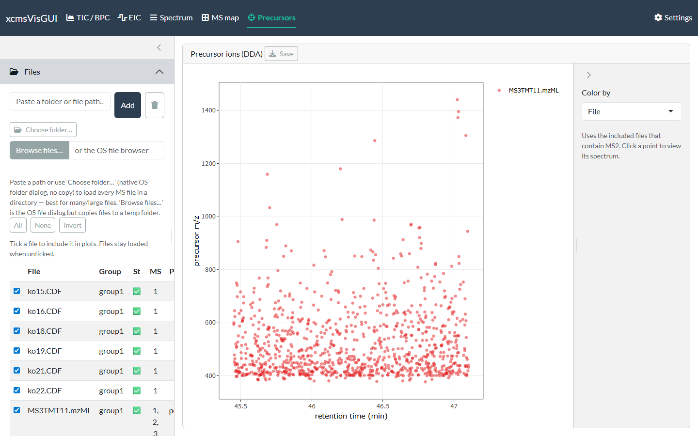

```{r, include = FALSE}
knitr::opts_chunk$set(echo = FALSE, eval = FALSE)
```

xcmsVisGUI is a local Shiny desktop app for exploring **raw** LC-MS data
interactively. This guide walks through a typical session. The screenshots come from
example LC-MS runs — a positive-mode QTOF urine series and the `faahKO` / `msdata`
demo datasets that ship with Bioconductor.

## Launch

The app is the exported function `run_app()`:

```{r, eval = FALSE, echo = TRUE}
# installed:
xcmsVisGUI::run_app()

# or from a clone (no install needed):
# Rscript run.R
```

A browser tab opens with five plot views across the top (TIC/BPC, EIC, Spectrum,
MS map, Precursors), a **Settings** page, and a left sidebar with **Files** and
**Filters**.

## 1. Load files

Open the **Files** panel and add data three ways — all keep multi-GB files in
place (no copy) except the OS file browser:

* **Paste a folder or file path** and click **Add** — loads every MS file in a
  folder (`.mzML` / `.mzXML` / `.CDF`).
* **Choose folder…** — native OS folder dialog (Windows), no copy.
* **Browse files…** — the OS file dialog; note it *copies* the chosen files to a
  temp folder.

Files are read asynchronously (a status badge flips from ⏳ to ✅), so the UI stays
responsive even with many files. **Click a file's row to include it** in the plots
(the row highlights); click it again to exclude. Files stay loaded either way, so
toggling is cheap. **All / None / Invert** select in bulk, and double-clicking the
**Group** cell renames that file's sample group (used for colouring and faceting).
As soon as one file is included, the TIC renders:

{width=100%}

## 2. Filter (optional)

The **Filters** panel applies globally to every view. Leave a box blank for no
limit; retention-time boxes use the display unit (set in Settings) and the data
range is shown as a hint.

{width=100%}

You can constrain retention time, *m/z*, intensity, MS level and polarity. The
**Spectrum ID** section matches against the raw spectrum id (e.g. the Waters
`function=1 process=0 scan=…`): add one or more rules with **Add rule**, each set to
**contains** (the id must include the term) or **exclude** (it must not). Multiple
`contains` rules are ANDed, so you can keep e.g. `function=1` while excluding
`function=2`. Matching is a literal substring (so `scan=1` also matches `scan=10`,
`scan=199`, …). **Reset filters** clears everything. If a filter combination matches
no spectra, the plots show "No spectra match the current filters." rather than an
error.

## 3. TIC / BPC

The first tab overlays the total- (sum) or base-peak (max) chromatogram of every
included file. **Color by** sample or sample group, optionally show data points,
and **click any trace** to jump to that scan's spectrum on the Spectrum tab.

## 4. EIC

Add extracted-ion chromatogram targets in the table (one row per *m/z*), or paste
a list of *m/z* values and click **Add to list**. Tolerance is a ± half-window in
ppm or Da (the default is set in Settings). Traces are overlaid across files and
coloured by file, target, or group; **Facet by file** separates them.

{width=100%}

## 5. Spectrum

Enter a retention time (or an acquisition scan number), or arrive here by clicking
a chromatogram trace. **Single file** shows the clicked file; **Facet** / **Stacked**
compare all included files at that retention time. Clicking a peak adds its *m/z*
to the EIC target list (unless the click action is switched to setting the
annotation anchor — see below).

{width=100%}

The **Scan list** button opens a searchable table of every scan's metadata (rt, MS
level, polarity, precursor *m/z*, TIC, base peak, spectrum ID). Type in the filter
boxes to narrow it, and click a row to load that scan.

{width=100%}

### Annotating adducts, isotopes & fragments

Tick **Annotate adducts / fragments** (single-file view) to overlay adduct,
isotope and in-source-fragment labels on the spectrum. The adduct/fragment
dictionary comes from the [commonMZ](https://github.com/stanstrup/commonMZ)
package; the ion mode defaults to the file's polarity.

{width=100%}

There are three modes:

- **Manual anchor** — pick the peak you believe is a known ion (default `[M+H]+` /
  `[M-H]-`, selectable). Switch *Click on a peak* to **→ set anchor** and click the
  peak, or type its *m/z*. The neutral mass is derived from it and every adduct and
  in-source fragment (from [commonMZ](https://github.com/stanstrup/commonMZ); the
  `[M+H-H2O]+` water-loss ladder, etc. — toggle with **In-source fragments**) is
  projected; matched peaks are labelled, and their isotopes (up to **Max isotope
  M+n**) are detected and labelled `[+1]`, `[+2]`, … An isotope peak is never also
  labelled an adduct/fragment. This is the most reliable mode — *you* decide the
  molecular ion, avoiding false hits on noisy raw data.
- **Auto-suggest (findMAIN)** — uses
  [InterpretMSSpectrum](https://cran.r-project.org/package=InterpretMSSpectrum)
  to rank candidate molecular-ion hypotheses (by explained intensity, mass error
  and isotope support). Hypotheses include the water-loss ion `[M+H-H2O]+`: if the
  base peak is itself a water loss, that is the right call and the neutral mass is
  derived from it (so `[M+H]+` is then annotated at base + 18). Press **Suggest
  molecular ion**; the top-scoring hypothesis is annotated immediately — click
  another row to switch. (Auto mode has no manual anchor box.)
- **Difference network** — annotates *pairs* of peaks whose *m/z* difference
  matches a known adduct/fragment, with no anchor needed (e.g. a ladder of water
  losses). Its match window is your instrument's mass accuracy at the two peaks,
  so set the tolerance to fit the instrument and raise the minimum intensity to
  drop noise pairs. Isotope-spaced differences are ignored.

The **± tol** is the adduct/fragment match window (ppm or Da); **Min intensity**
drops peaks below that fraction of the base peak before matching; **Max charge**
limits the charge states projected; **Annotate only top N peaks** keeps the N most
intense *annotated* peaks. **Isotope tol (mDa)** is a separate, usually wider
window for the isotope spacing (MS2 isotope centroids drift off the theoretical
spacing, and the error grows with each M+n step). **Isotopes decrease in
intensity** assumes a falling envelope (true for most biological samples) — with it
on, a heavier peak that is *more* intense is treated as a real loss (e.g. −H₂)
rather than an isotope. Labels are written vertically and multiple hits on one peak
are joined with "; ". **Show expected-but-absent** ghost ticks can be toggled.
Annotations are part of the plot, so they carry through to exports.

## 6. MS map

A 2-D *m/z* × retention-time map of the included files. It draws exact centroids
(no binning) with an mzMine-style contrast control — lower the contrast to reveal
weaker peaks. Press **Plot** to render (gated so it never auto-extracts every file).

{width=100%}

Switch the view to **3D surface** or **3D points** for a binned surface / scatter:

{width=100%}

## 7. Precursors (DDA)

For data-dependent acquisition, this maps each fragmented precursor ion
(retention time × precursor *m/z*) across the included MS2 files. Click a point to
view its spectrum.

{width=100%}

## 8. Settings

Settings persist across restarts (stored in your per-user config directory):

* **Retention-time unit** — minutes or seconds (applied everywhere; data is always
  handled in seconds internally).
* **Palettes** — ColorBrewer qualitative (traces/groups) and viridis/sequential
  (maps); the scale can be inverted.
* **EIC defaults** — default tolerance value and unit for new targets.
* **Parallel readers** — the mirai daemon-pool size for async file reading.
* **Export defaults** — format (png/svg/pdf), size, units, DPI.

{width=100%}

## Export

Every plot has a **Save** button that exports a crisp static image (png/svg/pdf via
`ggsave`) from the underlying ggplot — independent of the on-screen plotly — using
the size/format defaults from Settings.
